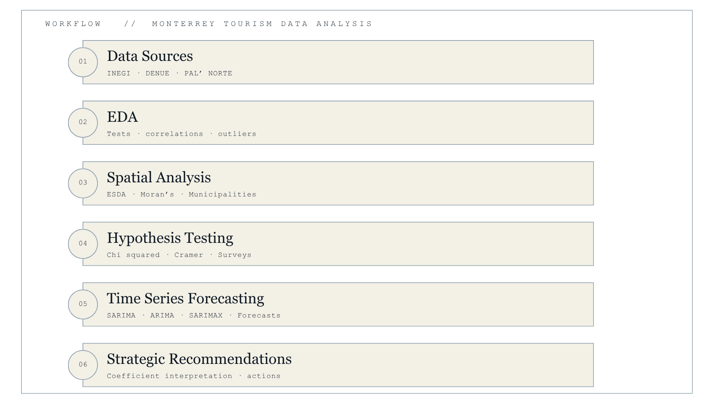
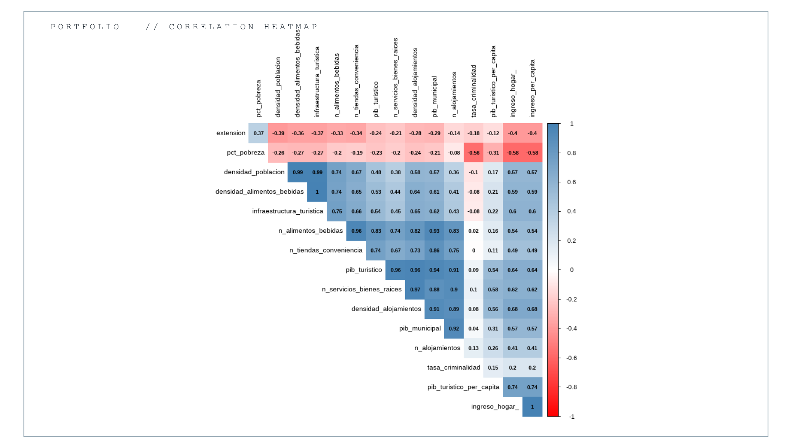
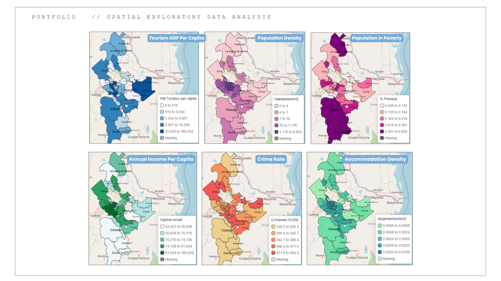
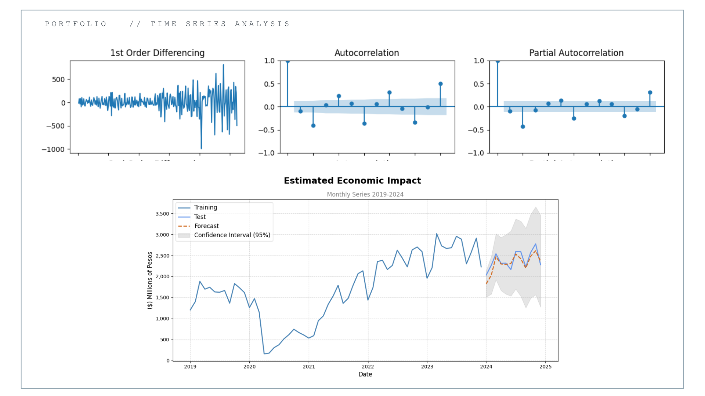

# Monterrey Tourism Analytics 2026

  

## Overview

This project presents a data-driven analytical framework to support tourism planning and strategic decision-making for Monterrey, Nuevo León, in preparation for the 2026 FIFA World Cup.

Using historical tourism, demographic, economic, and geospatial data, the project combines exploratory analysis, spatial statistics, hypothesis testing, and time series forecasting to identify tourism patterns, estimate future demand, and propose strategies to maximize the regional economic impact of one of the world's largest sporting events.

---

## Business Problem

Hosting the FIFA World Cup represents a major economic opportunity for Monterrey. However, maximizing tourism benefits requires understanding:

- Tourism demand patterns
- Visitor profiles
- Spatial distribution of attractions
- Municipal tourism potential
- Future tourism growth
- Economic spillover opportunities

This project develops an analytical framework to support evidence-based tourism planning.

---

## Objectives

- Analyze historical tourism trends in Nuevo León.
- Identify key tourism indicators and their relationships.
- Explore the spatial distribution of tourism activity across municipalities.
- Evaluate spatial autocorrelation and regional patterns.
- Develop forecasting models for tourism-related indicators.
- Generate strategic recommendations for tourism planning during the 2026 FIFA World Cup.

---

## Data Sources

The analysis integrates multiple public and proprietary datasets, including:

- INEGI
- DATATUR
- DENUE
- Google Maps API
- MODECULT
- Nuevo León Tourism Indicators
- Pa'l Norte 2025 Visitor Survey

---

## Methodology

The project follows a complete analytical workflow:

  

### 1. Data Preparation

- Data integration
- Cleaning
- Feature engineering
- KPI construction

### 2. Exploratory Data Analysis (EDA)

- Descriptive statistics
- Correlation analysis
- Tourism indicators
- Data visualization

  

### 3. Exploratory Spatial Data Analysis (ESDA)

- Municipal spatial analysis
- Spatial autocorrelation (Moran's I)
- Tourism infrastructure analysis
- Geographic visualization

  

### 4. Statistical Analysis

- Normality tests
- Stationarity tests
- Hypothesis testing
- Model diagnostics

### 5. Forecasting

Time series forecasting was performed for strategic tourism indicators using forecasting techniques and statistical validation.

  

---

## Technologies

### Languages

- R
- Python

---

## Key Results

- Identified **Monterrey, San Pedro Garza García, and Santiago** as the municipalities with the strongest tourism potential, characterized by well-developed tourism infrastructure, high per capita income, and relatively low poverty levels.
- Identified **Bustamante, Allende, and China** as emerging tourism destinations with significant potential, suggesting opportunities for regional tourism development and a more balanced distribution of economic benefits.
- Found that the predominant visitor profile consists of **young adults with a high willingness to spend on entertainment and cultural activities**, reflecting the growing influence of large-scale events such as music festivals on tourism demand.
- Identified statistically significant relationships between **household income, tourism infrastructure, and tourism GDP per capita**, suggesting that municipalities with stronger socioeconomic conditions tend to exhibit greater tourism economic performance.
- Developed forecasting models for key tourism indicators to support strategic planning and evidence-based decision-making for the 2026 FIFA World Cup.

---

## Documentation

This repository includes:

- Complete analytical code
- Technical report (Spanish)
- Final presentation (Spanish)
- Visualizations
- Forecasting results

---
